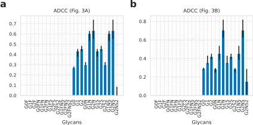
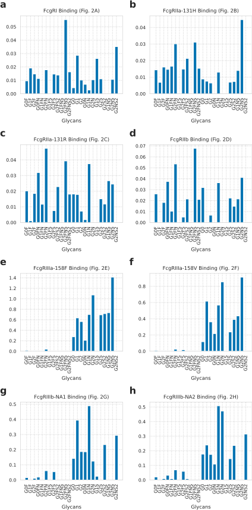

---
title: Glycan deconvolution reveals the activity of specific forms
keywords:
- markdown
- publishing
- manubot
lang: en-US
date-meta: '2021-04-30'
author-meta:
- Amanda Tsao
- Sumedha Kanthamneni
- Eva Hunter
- Aaron S. Meyer
header-includes: |-
  <!--
  Manubot generated metadata rendered from header-includes-template.html.
  Suggest improvements at https://github.com/manubot/manubot/blob/master/manubot/process/header-includes-template.html
  -->
  <meta name="dc.format" content="text/html" />
  <meta name="dc.title" content="Glycan deconvolution reveals the activity of specific forms" />
  <meta name="citation_title" content="Glycan deconvolution reveals the activity of specific forms" />
  <meta property="og:title" content="Glycan deconvolution reveals the activity of specific forms" />
  <meta property="twitter:title" content="Glycan deconvolution reveals the activity of specific forms" />
  <meta name="dc.date" content="2021-04-30" />
  <meta name="citation_publication_date" content="2021-04-30" />
  <meta name="dc.language" content="en-US" />
  <meta name="citation_language" content="en-US" />
  <meta name="dc.relation.ispartof" content="Manubot" />
  <meta name="dc.publisher" content="Manubot" />
  <meta name="citation_journal_title" content="Manubot" />
  <meta name="citation_technical_report_institution" content="Manubot" />
  <meta name="citation_author" content="Amanda Tsao" />
  <meta name="citation_author_institution" content="Department of Bioinformatics, University of California, Los Angeles" />
  <meta name="citation_author_orcid" content="0000-0002-4912-830X" />
  <meta name="citation_author" content="Sumedha Kanthamneni" />
  <meta name="citation_author_institution" content="Department of Bioengineering, University of California, Los Angeles" />
  <meta name="citation_author_orcid" content="XXXX-XXXX-XXXX-XXXX" />
  <meta name="citation_author" content="Eva Hunter" />
  <meta name="citation_author_institution" content="Department of Bioengineering, University of California, Los Angeles" />
  <meta name="citation_author_orcid" content="0000-0001-6087-1439" />
  <meta name="citation_author" content="Aaron S. Meyer" />
  <meta name="citation_author_institution" content="Department of Bioengineering, University of California, Los Angeles" />
  <meta name="citation_author_institution" content="Department of Bioinformatics, University of California, Los Angeles" />
  <meta name="citation_author_institution" content="Jonsson Comprehensive Cancer Center, University of California, Los Angeles" />
  <meta name="citation_author_institution" content="Eli and Edythe Broad Center of Regenerative Medicine and Stem Cell Research, University of California, Los Angeles" />
  <meta name="citation_author_orcid" content="0000-0003-4513-1840" />
  <meta name="twitter:creator" content="@aarmey" />
  <link rel="canonical" href="https://meyer-lab.github.io/Fc-deconvolute/" />
  <meta property="og:url" content="https://meyer-lab.github.io/Fc-deconvolute/" />
  <meta property="twitter:url" content="https://meyer-lab.github.io/Fc-deconvolute/" />
  <meta name="citation_fulltext_html_url" content="https://meyer-lab.github.io/Fc-deconvolute/" />
  <meta name="citation_pdf_url" content="https://meyer-lab.github.io/Fc-deconvolute/manuscript.pdf" />
  <link rel="alternate" type="application/pdf" href="https://meyer-lab.github.io/Fc-deconvolute/manuscript.pdf" />
  <link rel="alternate" type="text/html" href="https://meyer-lab.github.io/Fc-deconvolute/v/c381ec7ee1188157cda50a0b0e31be23c4072b2e/" />
  <meta name="manubot_html_url_versioned" content="https://meyer-lab.github.io/Fc-deconvolute/v/c381ec7ee1188157cda50a0b0e31be23c4072b2e/" />
  <meta name="manubot_pdf_url_versioned" content="https://meyer-lab.github.io/Fc-deconvolute/v/c381ec7ee1188157cda50a0b0e31be23c4072b2e/manuscript.pdf" />
  <meta property="og:type" content="article" />
  <meta property="twitter:card" content="summary_large_image" />
  <link rel="icon" type="image/png" sizes="192x192" href="https://manubot.org/favicon-192x192.png" />
  <link rel="mask-icon" href="https://manubot.org/safari-pinned-tab.svg" color="#ad1457" />
  <meta name="theme-color" content="#ad1457" />
  <!-- end Manubot generated metadata -->
bibliography: []
manubot-output-bibliography: output/references.json
manubot-output-citekeys: output/citations.tsv
manubot-requests-cache-path: cache/requests-cache
manubot-clear-requests-cache: false
...

<small><em>
This manuscript
([permalink](https://meyer-lab.github.io/Fc-deconvolute/v/c381ec7ee1188157cda50a0b0e31be23c4072b2e/))
was automatically generated
from [meyer-lab/Fc-deconvolute@c381ec7](https://github.com/meyer-lab/Fc-deconvolute/tree/c381ec7ee1188157cda50a0b0e31be23c4072b2e)
on April 30, 2021.
</em></small>

## Authors

+ **Amanda Tsao** 
    ORCID
    [0000-0002-4912-830X](https://orcid.org/0000-0002-4912-830X)
    · Github
    [ajtsao1](https://github.com/ajtsao1) 
  <small>
     Department of Bioinformatics, University of California, Los Angeles
  </small>

+ **Sumedha Kanthamneni** 
    ORCID
    [XXXX-XXXX-XXXX-XXXX](https://orcid.org/XXXX-XXXX-XXXX-XXXX)
    · Github
    [sumedha-k](https://github.com/sumedha-k) 
  <small>
     Department of Bioengineering, University of California, Los Angeles
  </small>

+ **Eva Hunter** 
    ORCID
    [0000-0001-6087-1439](https://orcid.org/0000-0001-6087-1439)
    · Github
    [evahunter](https://github.com/evahunter) 
  <small>
     Department of Bioengineering, University of California, Los Angeles
  </small>

+ **Aaron S. Meyer** 
    ORCID
    [0000-0003-4513-1840](https://orcid.org/0000-0003-4513-1840)
    · Github
    [aarmey](https://github.com/aarmey)
    · twitter
    [aarmey](https://twitter.com/aarmey) 
  <small>
     Department of Bioengineering, University of California, Los Angeles; Department of Bioinformatics, University of California, Los Angeles; Jonsson Comprehensive Cancer Center, University of California, Los Angeles; Eli and Edythe Broad Center of Regenerative Medicine and Stem Cell Research, University of California, Los Angeles
  </small>

## Abstract {.page_break_before}

## Results

### Glycans mixtures display multivariate changes in FcγR binding and effector response

Plots of the raw data should go in the supplement.

{#fig:fig1 width="100%"}

### Deconvolution infers the properties of pure glycan species

This just shows ADCC, then the rest of the measurements can go in the supplement.

![**Deconvolution infers the properties of pure glycan species.** A) Schematic of the process of deconvolution. Briefly, the observed properties of a glycan mixture can be considered to be an additive combination of the individual molecular species. Therefore, with measurements of the mixtures' properties, we can fit the inferred properties of individual species. B–C) Inferred anti-D (B) and anti-TNP (C) ADCC activities of individual glycan species, allowing each species to have its own inferred activitity. D–E) Inferred activity with the additional assumption that fucosylated forms share their activity, and that sialation does not affect activity (e.g., G1 and G1S share activity). F–G) Comparison of the inferred anti-D (F) and anti-TNP (G) ADCC for each mixture to the mixture activity measurements. Error bars indicate the 67% confidence interval (standard error).](figure2.svg "Figure 2"){#fig:fig2 width="100%"}

### Deconvolution provides enhanced resolution for the activity of individual glycan forms

{#fig:fig3 width="100%"}

### Section

{#fig:fig4 width="100%"}

### Section

{#fig:fig5 width="100%"}

## Acknowledgements

This work was supported by NIH U01-AI-148119 to A.S.M. The authors declare no competing financial interests. We thank Gestur Vidarsson for assistance in obtaining the source data for our analysis.

## Author contributions statement

A.S.M. conceived of the study. All authors performed the computational analysis and wrote the paper.

## References {.page_break_before}

<!-- Explicitly insert bibliography here -->

